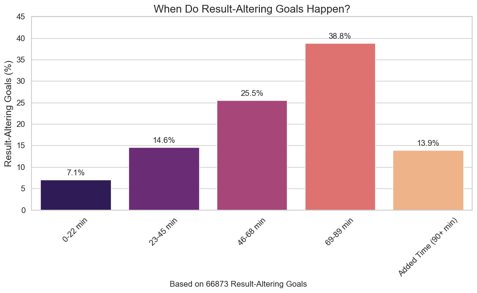
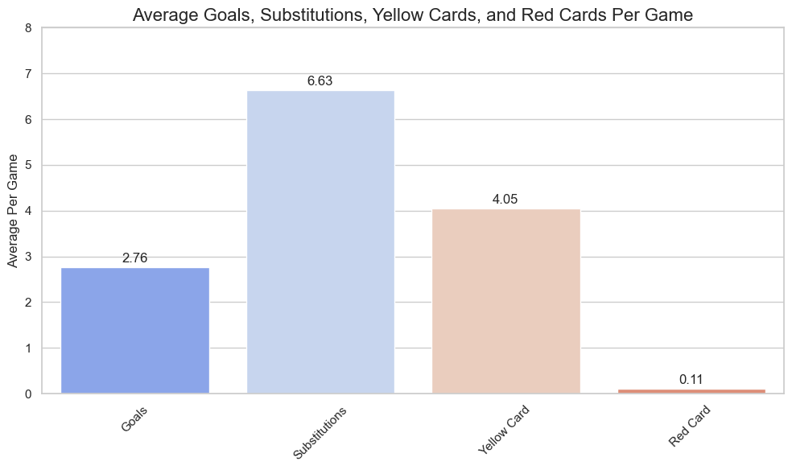
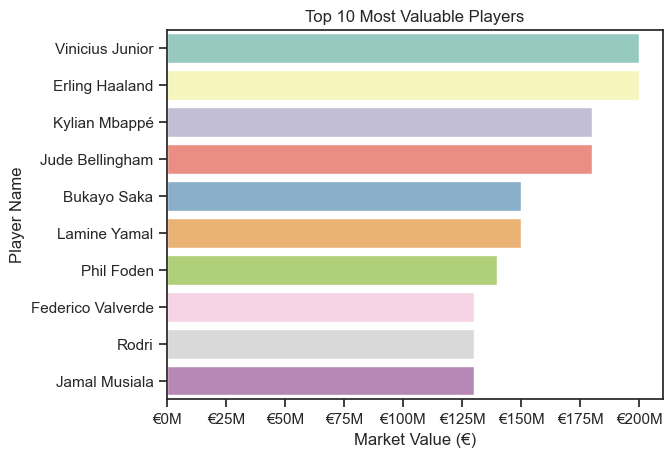
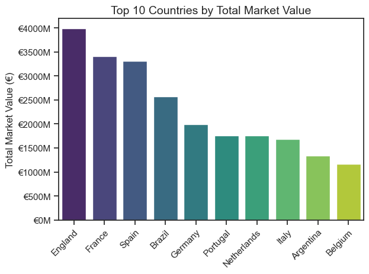
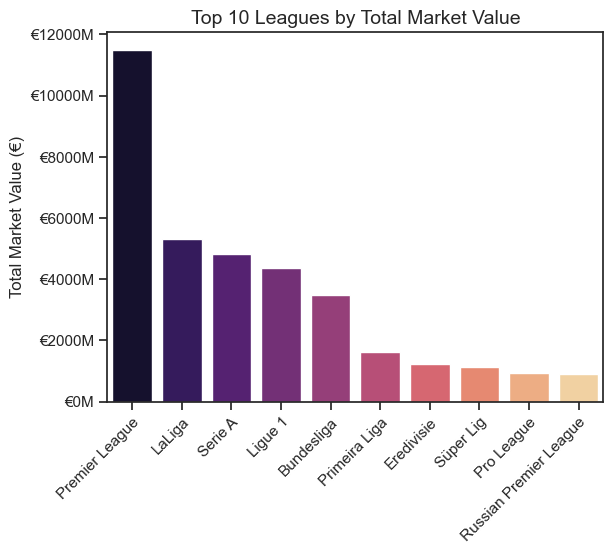
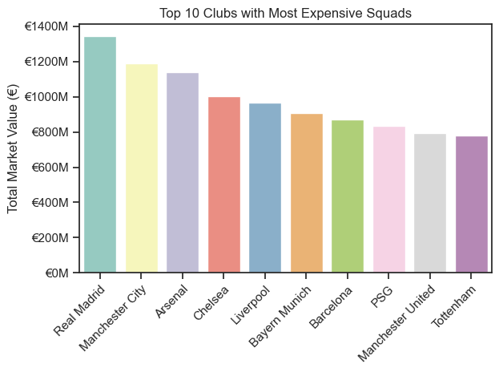
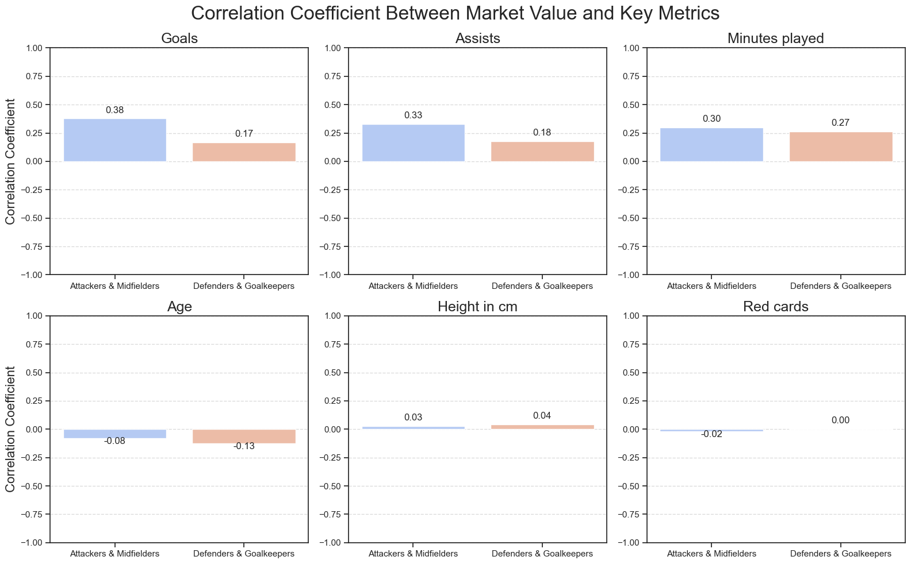
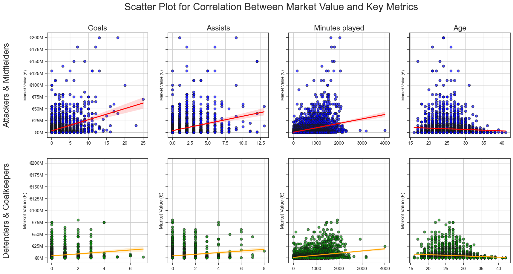
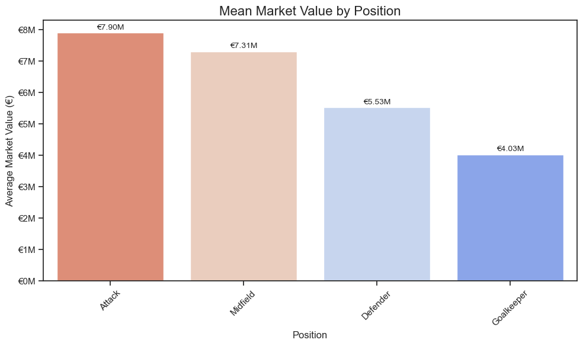
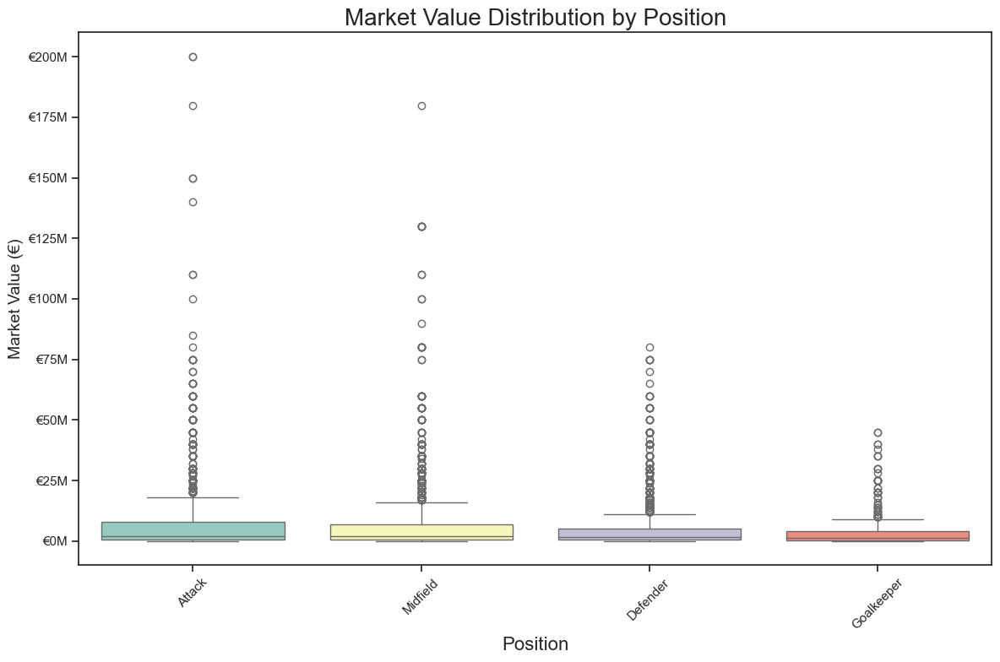

# Introduction

Welcome to my project analyzing football data scraped from Transfermarkt. This project combines my passion for football with my goal to improve my Python skills in data analysis.
In this analysis, I aim to uncover trends in the football industry and share insights that could be valuable for enthusiasts, analysts, or anyone curious about the beautiful game. Below, you'll find a dedicated section listing the key questions answered throughout this project.

# The Questions
### Crucial Moments in Football
- When do result-altering goals typically occur during a match?
- What percentage of crucial goals are scored in added time?

### Club, Country, and League Trends
- Which clubs have assembled the most expensive squads?
- Which countries produce the most valuable players, and how does this correlate with their footballing reputation?
- What are the market value trends among the top European leagues?

### Player Performance and Market Value
- What metrics contribute most to a player's market value (e.g., goals, assists, minutes played)?
- How does age influence a player's market value over their career?
- Which positions (attackers, midfielders, defenders, goalkeepers) tend to have the highest market value, and why?

# 1. Football Match Data Analysis

This first section will focus on the data from actual football matches. 

Here's the complete notebook: [1_Match_Data_Analysis.ipynb](1_Match_Data_Analysis.ipynb)

##  When Do Result-Altering Goals Happen in Football?

When I looked at the data, I saw that there were an unreasonable amout of events happening exactly at 90 minutes in matches, so I concluded that all the events in added time (90+) were being assigned to the 90 minute mark. Becuase I wanted focus on matches that didn't have extra time, I decided to filter out those matches. I also only incuded events that were the last goal in each match. 

```python
def assign_interval(row):
    if row['minute'] <= 22:
        return '0-22 min'
    elif row['minute'] <= 45:
        return '23-45 min'
    elif row['minute'] <= 68:
        return '46-68 min'
    elif row['minute'] < 90:
        return '69-89 min'
    elif row['minute'] == 90:
        return 'Added Time (90+ min)'
    else:
        return 'Extra Time'

# Assign intervals
game_events['interval'] = game_events.apply(assign_interval, axis=1)
game_events = game_events[game_events['interval'] != 'Extra Time']

# filter for goals only
goals = game_events[game_events['type'] == 'Goals'].copy()
last_goals = goals.loc[goals.groupby('game_id')['minute'].idxmax()]
```

After this, I had to Identify the results that were result-altering. I did this by running the dataset through the  function below:

```python
# Identify result-altering goals
def is_result_altering_goal(row, match_goals):
    game_id = row['game_id']
    club_id = row['club_id']
    minute = row['minute']
    
    # Filter goals for the current match
    match_goals = match_goals[match_goals['game_id'] == game_id].sort_values('minute').reset_index(drop=True)
    if match_goals.empty: 
      return False

    # Calculate cumulative scores for each team
    match_goals['team_score'] = match_goals.groupby('club_id').cumcount() + 1
    match_goals['opponent_score'] = match_goals.groupby('game_id').transform('sum')['team_score'] - match_goals['team_score']

    # Get scores before and after this goal
    current_position = match_goals[match_goals['minute'] == minute].index[0]
    pre_goal_score_team = match_goals.iloc[current_position - 1]['team_score'] if current_position > 0 else 0
    pre_goal_score_opponent = match_goals.iloc[current_position - 1]['opponent_score'] if current_position > 0 else 0
    post_goal_score_team = match_goals.iloc[current_position]['team_score']
    post_goal_score_opponent = match_goals.iloc[current_position]['opponent_score']

    # Determine if this goal altered the result
    pre_goal_result = "draw" if pre_goal_score_team == pre_goal_score_opponent else ("win" if pre_goal_score_team > pre_goal_score_opponent else "loss")
    post_goal_result = "draw" if post_goal_score_team == post_goal_score_opponent else ("win" if post_goal_score_team > post_goal_score_opponent else "loss")
    
    return pre_goal_result != post_goal_result
```

### Visualize data

```python
plt.figure(figsize=(10, 6))
sns.barplot(
    data=interval_stats,
    x="interval",
    y="result_altering_goal_percentage",
    hue="interval",
    palette="magma"
)

plt.title("When Do Result-Altering Goals Happen?", fontsize=16)
total_goals = len(last_goals)
plt.figtext(0.5, 0, f"Based on {total_goals} Result-Altering Goals", wrap=True, horizontalalignment='center', fontsize=12)

for index, row in interval_stats.iterrows():
    plt.text(index, row['result_altering_goal_percentage'] + 1, f"{row['result_altering_goal_percentage']:.1f}%", 
             ha='center', fontsize=12)

plt.tight_layout()
plt.show()
```


*Bar plot visualizing the percentage of result-altering goals in the different time periods of 66873 matches.*

### Insights

- Most of the result-altering goals (38.8%) occurr in the last quater of the match, which is expected.
- Though it is the shortest interval, a suprisingly large amount (13.9%) of result-altering goals happen in added time, which is a good reason to watch till the end!
- 7.1% of matches are decided within the first 22 minutes.

## Average Goals, Substitutions, Yellow Cards, and Red Cards Per Game

A little bonus bit of data that I was curious in. For this graph I had to seperate the yellow cards and red cards.

```python
# Filter relevant event types and extract Yellow and Red cards
game_events['Yellow Card'] = game_events['description'].str.contains('Yellow card', case=False, na=False).astype(int)
game_events['Red Card'] = game_events['description'].str.contains('Red card', case=False, na=False).astype(int)

# Include only relevant types
filtered_events = game_events[game_events['type'].isin(['Goals', 'Substitutions'])]

# Aggregate by game_id
event_counts = filtered_events.groupby(['game_id', 'type']).size().unstack(fill_value=0)
event_counts['Yellow Card'] = game_events.groupby('game_id')['Yellow Card'].sum()
event_counts['Red Card'] = game_events.groupby('game_id')['Red Card'].sum()
average_events_per_game = event_counts.mean()
```
### Visualize data

```python
sns.set_theme(style="whitegrid")
plt.figure(figsize=(10, 6))
ax = sns.barplot(x=average_events_per_game.index, y=average_events_per_game.values, hue=average_events_per_game.index, palette='coolwarm')

for i, value in enumerate(average_events_per_game.values):
    ax.text(i, value + 0.1, f'{value:.2f}', ha='center', fontsize=12)

plt.tight_layout()
plt.show()
```


### Insights

- On average, there are **6.63** substitutions per game, far exceeding other metrics such as goals (**2.76**) and yellow cards (**4.05**). This highlights the heavy use of substitutions as a tactical tool in modern football, especially with recent changes allowing more substitutions per game.
- Red cards occur at an average of **0.11** per game, making them the least common event by far.

# 2. Player Market Value Analysis

This section dives into the factors that influence a player's market value and how different attributes, such as goals, assists, and appearances, correlate with higher valuations.

Here's the complete notebook: [2_Market_Value_Analysis.ipynb](2_Market_Value_Analysis.ipynb)

## Preprocessing and Cleaning

To analyze player market values, 3 dataframes (players, appearances, and games) were merged with a new dataframe containing the sum of key performance statistics. Here’s an overview of the preprocessing steps:

```python
# Merging datasets
Full_Player_Data = players.merge(appearances, on='player_id')
Full_Player_Data = Full_Player_Data.merge(games[['game_id', 'season']], on='game_id')
Full_Player_Data = Full_Player_Data[Full_Player_Data['season'].isin([2024])]

# Making dataframe with the sum of cetain attributes
Player_stats = Full_Player_Data.groupby('name').agg({
    'yellow_cards': 'sum', 
    'red_cards': 'sum', 
    'goals': 'sum', 
    'assists': 'sum',
    'minutes_played': 'sum',
    'appearance_id': 'count'
}).reset_index()

# Merging and cleaning
Full_Player_Data = Full_Player_Data.merge(Player_stats, how='left', on='name')
Full_Player_Data.rename(columns={'appearance_id': 'appearances'}, inplace=True)
Full_Player_Data.drop_duplicates(inplace=True)
Full_Player_Data.dropna(inplace=True)
```
I also added an age column using the date of birth of the players.

```python
# Adding age column
Full_Player_Data['date_of_birth'] = pd.to_datetime(Full_Player_Data['date_of_birth'])
today = pd.to_datetime('today')
Full_Player_Data['age'] = (today - Full_Player_Data['date_of_birth']).dt.days // 365
Full_Player_Data.drop(columns=['date_of_birth'])
```

## Top 10 Most Valuable Players
```python
Top_10_Players = Full_Player_Data.head(10)

sns.set_theme(style="ticks")
sns.barplot(data=Top_10_Players, x='market_value_in_eur', y='name', hue='name', palette='tab10')
ax = plt.gca()
ax.xaxis.set_major_formatter(plt.FuncFormatter(lambda x, _: f'€{int(x/1000000)}M'))
plt.title('Top 10 Most Valuable Players')
plt.xlabel('Market Value (€)')
plt.ylabel('Player Name')
plt.show()
```


### Insights
- **Vinicius Junior** and **Erling Haaland** are the two most valuable players, both valued at €200M.
- Young players like **Lamine Yamal** and **Jude Bellingham** make the list, showcasing the rising trend of high valuations for emerging talents.
- Players from clubs like **Real Madrid** and **Manchester City** reflect the concentration of top talent in elite teams.

---

## Top 10 Countries and Leauges with Most Expensive Players
This is for the the top 10 countries by total market value of players.
```python
Top_10_Countries = (Full_Player_Data.groupby('country_of_citizenship')['market_value_in_eur'].sum().sort_values(ascending=False).head(10))

sns.set_theme(style="ticks")
sns.barplot(x=Top_10_Countries.index, y=Top_10_Countries.values, hue=Top_10_Countries.index, palette='viridis')
ax = plt.gca()
ax.yaxis.set_major_formatter(plt.FuncFormatter(lambda y, _: f'€{int(y/1000000)}M'))
plt.tight_layout()
plt.show()
```
This is for the top 10 leagues by total market value of players.

```python
Top_5_Leagues = Full_Player_Data.groupby('current_club_domestic_competition_id')['market_value_in_eur'].sum().sort_values(ascending=False).head(5)

leagues_names = [
    "Premier League", "LaLiga", "Serie A", "Ligue 1", "Bundesliga"
]
sns.set_theme(style="ticks")
sns.barplot (x=leagues_names, y=Top_5_Leagues.values, hue=leagues_names, palette='magma')
ax = plt.gca()
ax.yaxis.set_major_formatter(plt.FuncFormatter(lambda y, _: f'€{int(y/1000000)}M'))
plt.show()
```




### Insights
- England leads in total player market value among countries, around **€4 billion**, while the Premier League dominates leagues globally with close to **€12 billion** in total market value.
The connection between the two is evident: a large proportion of England’s high-value players play domestically in the Premier League, boosting both their country's and league's market value.

- European countries (e.g., England, France, Spain, Germany, and Portugal) dominate the country graph, reflecting their strong footballing cultures and development systems. Similarly, European leagues (Premier League in England, La Liga in Spain, Serie A in Italy, Ligue 1 in France, and Bundesliga in Germany) hold the top spots in the league graph, further emphasizing Europe’s central role in global football economics.

- In the country graph, Brazil and Argentina rank high due to their consistent production of world-class players, but they lack representation in the league graph.
This disparity highlights how top South American talents often transfer to European leagues, enriching those leagues while limiting the market value of domestic competitions in Brazil and Argentina.


---

## Top 10 Clubs with Most Expensive Squads
```python
Top_10_Clubs = Full_Player_Data.groupby('current_club_name')['market_value_in_eur'].sum().sort_values(ascending=False).head(10)

# Shorten the club names
short_club_list = [
    "Real Madrid", "Manchester City", "Arsenal", "Chelsea", 
    "Liverpool", "Bayern Munich", "Barcelona", "PSG", 
    "Manchester United", "Tottenham"
]
sns.set_theme(style="ticks")
sns.barplot (x=short_club_list, y=Top_10_Clubs.values, hue=short_club_list, palette='Set3')
ax = plt.gca()
ax.yaxis.set_major_formatter(plt.FuncFormatter(lambda y, _: f'€{int(y/1000000)}M'))
plt.tight_layout()
plt.show()
```


### Insights
- 6 out of the top 10 clubs are from England, showcasing the dominance of the Premier League.
- The inclusion of **Manchester City** and **PSG** highlights the impact of strategic investments by clubs outside traditional powerhouses.

---

## Correlation Between Market Value and Key Metrics
I used barplots to visualize the correlation between market value and key metrics for attack midfielders and defenders/goalkeepers.
```python
attributes = ['goals', 'assists', 'minutes_played', 'age', 'height_in_cm', 'red_cards']

attack_midfield = Full_Player_Data[Full_Player_Data['position'].isin(['Attack', 'Midfield'])]
defender_goalkeeper = Full_Player_Data[Full_Player_Data['position'].isin(['Defender', 'Goalkeeper'])]

fig, axes = plt.subplots(2, 3, figsize=(16, 10))  
fig.suptitle('Correlation Coefficient Between Market Value and Key Metrics', fontsize=24)

# Loop through each attribute and plot its bar chart
for i, attr in enumerate(attributes):
    
    attack_midfield_corr = attack_midfield[[attr, 'market_value_in_eur']].corr().iloc[0, 1]
    defender_goalkeeper_corr = defender_goalkeeper[[attr, 'market_value_in_eur']].corr().iloc[0, 1]

    # Create a DataFrame for the current attribute's correlations
    correlation_df = pd.DataFrame({
        'Group': ['Attackers & Midfielders', 'Defenders & Goalkeepers'],
        'Correlation': [attack_midfield_corr, defender_goalkeeper_corr]
    })

    # Position in the 2x3 grid
    ax = axes[i // 3, i % 3]

    sns.barplot(x='Group', y='Correlation', hue='Group', data=correlation_df, palette='coolwarm', dodge=False, ax=ax)
    ax.set_title(f'{attr.replace("_", " ").capitalize()}', fontsize=18)
    ax.set_ylim(-1, 1)  
    ax.grid(axis='y', linestyle='--', alpha=0.7)
    ax.set_xlabel('')

    if i % 3 == 0: 
        ax.set_ylabel('Correlation Coefficient', fontsize=16)
    else:
        ax.set_ylabel('') 

    # Annotate bars with the exact correlation values
    for j, value in enumerate(correlation_df['Correlation']):
        ax.text(j, value + 0.05 if value > 0 else value - 0.05, f'{value:.2f}', ha='center', fontsize=12)

plt.tight_layout()
plt.show()
```
To complement the barplot and provide a deeper understanding of these relationships, I also created scatter plots. These visualizations highlight the individual data points and include trend lines to illustrate the overall correlation between market value and key metrics.

```python
attributes_2 = ['goals', 'assists', 'minutes_played', 'age']

fig, axes = plt.subplots(2, len(attributes_2), figsize=(20, 10), sharey=True) 
fig.suptitle('Scatter Plot for Correlation Between Market Value and Key Metrics', fontsize=24)

# Add row-specific titles
axes[0, 0].annotate(
    'Attackers & Midfielders', xy=(0.5, 0.5), xytext=(-0.4, 0.5),
    textcoords='axes fraction', fontsize=20, ha='center', va='center', rotation=90
)

axes[1, 0].annotate(
    'Defenders & Goalkeepers', xy=(0.5, 0.5), xytext=(-0.4, 0.5),
    textcoords='axes fraction', fontsize=20, ha='center', va='center', rotation=90
)

for i, attr in enumerate(attributes_2):

    sns.regplot(
        x=attack_midfield[attr],
        y=attack_midfield['market_value_in_eur'],
        scatter_kws={'alpha': 0.7, 'color': 'blue', 'edgecolor': 'k'},
        line_kws={'color': 'red'},
        ax=axes[0, i]
    )
    axes[0, i].set_title(f'{attr.replace("_", " ").capitalize()}', fontsize=18)
    axes[0, i].set_xlabel('')
    axes[0, i].set_ylabel('Market Value (€)', fontsize=10)
    axes[0, i].grid(True)

    ax = axes[0, i]
    ax.yaxis.set_major_formatter(plt.FuncFormatter(lambda y, _: f'€{int(y / 1000000)}M'))

    sns.regplot(
        x=defender_goalkeeper[attr],
        y=defender_goalkeeper['market_value_in_eur'],
        scatter_kws={'alpha': 0.7, 'color': 'green', 'edgecolor': 'k'},
        line_kws={'color': 'orange'},
        ax=axes[1, i]
    )
    axes[1, i].set_title('')
    axes[1, i].set_xlabel('')
    axes[1, i].set_ylabel('Market Value (€)', fontsize=12)
    axes[1, i].grid(True)

plt.show()
```

*Barplot showcasing the relationship between market value and key metrics for attackers and midfielders, defenders and goalkeepers.*


*Scatter plot going into further detail.*

### Insights
- **Goals** and **assists** exhibit the strongest positive correlations with market value, particularly for attackers and midfielders, highlighting the premium placed on offensive contributions in football.  
- **Minutes played** demonstrates a moderate correlation across all positions, emphasizing the importance of consistency, availability, and reliability in determining a player's value.  
- Physical attributes like **height** and disciplinary factors such as **red cards** show negligible or no correlation with market value, indicating their minimal impact on how players are valued.  
- **Age** has a slightly negative correlation, suggesting that market value tends to decline with age. However, the weak magnitude of this relationship reflects that other factors, like performance and potential, may mitigate the effect of age.  


## Market Value for Different Positions
To figure out which positions are most valued, I calculated the mean market value for each position and also visualized the distribution with a box plot.

The code below is for the mean market value bar plot:
```python
position_stats = Full_Player_Data.groupby('position')['market_value_in_eur'].agg(['mean', 'median', 'count']).sort_values(by='mean', ascending=False)

plt.figure(figsize=(10, 6))
sns.barplot(x=position_stats.index, y=position_stats['mean'], hue=position_stats.index, palette='coolwarm_r')
for i, value in enumerate(position_stats['mean']):
    plt.text(i, value + 100000, f'€{value / 1_000_000:.2f}M', ha='center', fontsize=10)
ax = plt.gca()
ax.yaxis.set_major_formatter(plt.FuncFormatter(lambda y, _: f'€{int(y/1000000)}M'))
plt.title('Mean Market Value by Position', fontsize=16)
plt.xlabel('Position', fontsize=12)
plt.ylabel('Average Market Value (€)', fontsize=12)
plt.xticks(rotation=45)
plt.tight_layout()
plt.show()
```
This is for the box plot:
```python
plt.figure(figsize=(12, 8))
sns.boxplot(x='position', y='market_value_in_eur', data=Full_Player_Data, hue='position', palette='Set3')
ax = plt.gca()
ax.yaxis.set_major_formatter(plt.FuncFormatter(lambda y, _: f'€{int(y/1000000)}M'))
plt.title('Market Value Distribution by Position', fontsize=20)
plt.xlabel('Position', fontsize=16)
plt.ylabel('Market Value (€)', fontsize=14)
plt.xticks(rotation=45)
plt.tight_layout()
plt.show()
```




### Insights
### **Insights from Market Value by Position**

   - Attackers (**€7.90M**) and midfielders (**€7.31M**) lead in average market value, reflecting the premium placed on offensive and creative roles in football. Their contributions to goals and assists make them more appealing to fans.  

   - Defenders (**€5.53M**) and goalkeepers (**€4.03M**) have significantly lower average market values compared to their attacking counterparts. While they play critical roles, their market impact appears less pronounced, as evidenced by tighter distributions and fewer high-value outliers.

   - Attackers and midfielders show the greatest variability, with outliers up to **€200M**. This indicates a high ceiling for standout performers in these positions, while defenders and goalkeepers see more consistency, with fewer record-breaking valuations.

# Conclusion

- **Result-Altering Goals**: Crucial goals often occur in the final stages of matches, with 38.8% happening between the 69th and 89th minute and another 13.9% in added time. This demonstrates the significance of the closing moments of a game, where players and teams make decisive contributions.

- **Leagues and National Representation**: The Premier League dominates in total market value, showcasing its financial strength and global appeal. Countries like England, France, and Brazil consistently produce the most valuable players, contributing to their clubs' and leagues' success on the global stage.

- **Key Drivers of Market Value**: Goals, assists, and minutes played emerged as the most influential metrics for determining a player’s market value, especially for attackers and midfielders. In contrast, attributes like height and disciplinary records showed little to no correlation with value. 

- **Position-Based Value Trends**: Attackers and midfielders command the highest average market values, reflecting the premium placed on offensive contributions. Defenders and goalkeepers, while essential, are often undervalued, with fewer standout outliers driving their market ceilings.

- **Insights for Future Exploration**: Understanding how performance metrics translate into market value provides valuable insights for fans, analysts, and decision-makers. Future analysis could dive deeper into the influence of external factors, like media hype or transfer market dynamics, on player valuations.
